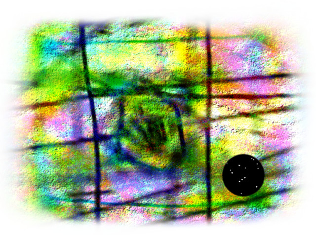

:tocdepth: 1

.. _article_19:

A Creation
==========

.. container:: center

    by :ref:`brant`

I don't know what I want to create. I'm compelled to create.

I made a picture:

I don't know what I want to say. I'm compelled to say something.

I made an article:

I have nothing I want to really express that I can think of, nothing I really
need to get across to others. I just want to make something.

I lack the skill to express what I want to express and I also don't want to
put something in the world in which I give too much of myself. If I make
something and pour my soul into it then in a way it's no longer mine. The
purpose of it originated solely in intent but once something is made manifest
it's of the world and out of and beyond me. What I really want to express is
something I don't know that I can put in the world for fear of it's perversion
via the interpretation and perception of others and their monumentally foolish
belief in absolutes.

I'm holding on to my own self for now. I am the sovereign of my own personal
domain.

And yet I want to share. To build. To create.

So I made a picture. It's for you. It's for everyone. The intent is love and
the spirit of creation. It's meant to be a vehicle. It's got no meaning other
than what everyone else puts inside it. It's yours to do as you wish with.
Everyone is so busy obsessing over the political landscape and arguing and
being emotional about who is right and wrong in all these arguments... fuck
that. I have no more energy for destruction. I've no desire to dwell in these
petty worlds it seems like everyone is sinking into. Break the loop. Climb out
and look around. Join me. Let's all make things.
