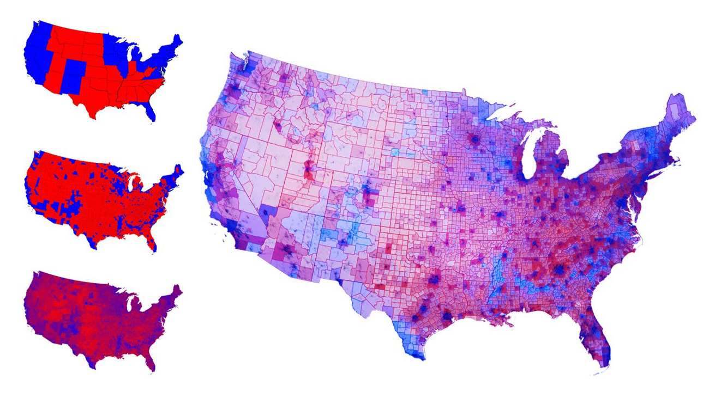

:tocdepth: 1

.. _article_8:

Why the Electoral College Needs to End
======================================

:ref:`chris`
------------

Five times in American history we have elevated someone to the office of
President without a popular mandate. It is a quirk of history that it has, each
and every time, been at the expense of a Democrat, beginning with the party's
founder, Andrew Jackson. (I recommend doing some research on him—he is probably
the best historical example of a Donald Trump presidency.)

And perhaps this tendency for Democrats to be on the losing end of these
arrangements has led to the predominance in Republican thought of the
importance of the Electoral College as a defense against the tyranny of the
city over the countryside.

That may or may not be true. I tend to side on the side that says we should
stop putting the power of electing our president in the hands of a few select
geographic regions that have an equally divided rhetoric, but that isn't really
the point of this post. (Since it is my post though I reserve the right to
present that argument in a biased manner.)

The real sin of the Electoral College has nothing to do with accurate voter
representation. It has to do with the battle mentality it creates on the part
of adherents to both parties.

Under the EC we live in a divided nation. Red States vs Blue States. Wars are
fought to wrestle control of the swing states from the other side. We no longer
see diverse communities engaging in the democratic process. Instead we see
entire swaths of the country alternating between friend and foe.

In reality, there is not that much division. Check out these maps depicting the
election results from 2012
(http://gizmodo.com/5960290/this-is-the-real-political-map-of-america-hint-we-are-not-that-divided) and 2016
(http://www-personal.umich.edu/~mejn/election/2016/). The large map that
displays :ref:`below<divmap>` is beautiful. It depicts a vibrant country full of diversity and
inter-dependence.

That is not what your standard EC map shows you. Much has been made about how
Trump won Michigan and Wisconsin. But these weren't landslides. These states
didn't suddenly become staunch Republican strongholds. Clinton won ~3.7 million
votes in those two states combined, almost the same as Trump.

The Presidency is the only truly national office. A Senate seat is a federal
position, but it is meant to represent the state from which he or she heralds.
The President is expected to eschew any sentimental ties with their region of
origin in support of the United States. And the EC is a vestige of a different
time that with it's very existence puts us into a mentality of division and
separation.

We are not divided. We need a system that reinforces our national bonds. We
need to come together in celebration of the communal act of voting to forge
anew the ties that bind us.

I am not naive. I know that this is not a cure-all. We won't suddenly agree on
everything. A popular vote system will likely hurt Democrats in the future as
much as it would hurt Republicans. But it is something. It is a symbol we can
point to and say that this is what America is. This is what we stand for. This
is why the left and the right are not at war, but are united as brothers in
celebration of freedom and democracy.

.. _divmap:

        The real political map of America: We are not that divided.
        Source: `Gizmoto
        <https://i.kinja-img.com/gawker-media/image/upload/s---SkJm7SQ--/c_scale,fl_progressive,q_80,w_800/1857qaput58u3jpg.jpg/>`_
