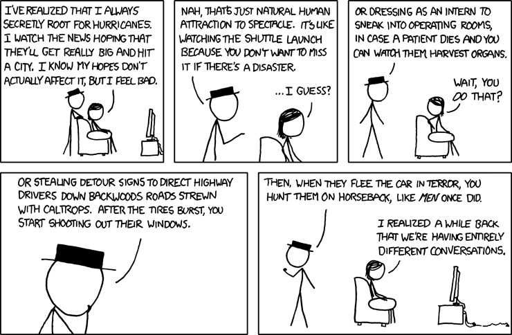

:tocdepth: 1

.. _article_16:

Fox is Boring
=============

.. container:: center

    by :ref:`brant`

        Hurricane forums are full of excited comments about central pressure
        and wind speed and comparisons to Camille and 1931 and 1938, with
        hastily-tacked-on notes about how it will be tragic if anyone dies and
        they hope it's a dud. Source: `XKCD <https://xkcd.com/611/>`__

Fox News rose to prominence by casting itself as *the* conservative channel. As
a business maneuver this was extraordinarily successful. The act of self
labeling as right of center left all the other news organizations to fight like
scavengers over the other half of the spectrum. It didn't take long for MSNBC
to attempt to clone the success of Fox by essentially becoming it's left wing
mirror. Early under Bush, Fox News was successful in courting a breed of
patriotism and acting as a bulwark against left wing anti-war sentiments. In
the Obama administration the news station was part of the cultural and
political opposition to the left wing power structures.

Now Fox's dominance is slipping. It's easy to think that is the result of
recent shake-ups in their line-up and some of the scandals that have plagued
the network but this isn't the whole story. Tucker Carlson took over Bill
O'Reilly's slot and initially easily maintained his ratings. In fact Fox
weathered most of the scandals just fine without a major loss in ratings, at
least until very recently.

While some may try to deny it on some level, people love spectacle. And whether
or not you think that the bulk of the drama surrounding the Trump
administration is a conspiracy by the left wing media cabal, completely true,
or some intricate and nuanced mixture of the two, it is difficult to miss the
fact that it's highly entertaining. Whether it's invented or not, Fox is
missing the best political soap opera in recent memory—maybe even the best in
all of American history.

Currently Fox and it's evening comentary shows are running headlines that are
permutations of the following:

- Why [insert latest scandal here] isn't a big deal
- Leftist anti-free speech on college campus
- Stories about cultural wars:
  - people saying bad things about Trump
  - paid protestors
  - snowflake generation articles about millenials
  - ethnic/sexual/gender idenity
  - people faking hate-speech
- Hillary/Killary scandals or shady dealings

Obviously this is a bit of a strawman as it's not easy to do a deep statistical
topical analysis. In any case though I think it's the source of Fox's recent
problems. Some of those stories have been running on Fox in some form or
another for years now. That gets boring no matter how good or accurate the
actual stories are.

News is—by some definitions anyway—what's going wrong. No one wants to see the
headline **"112,924 Flights Landed Safely Today"** on the front page every day.
It's not news. By not joining in the media's feeding frenzy over the Trump
administration, Fox is missing out on the fodder that is driving the ratings of
their competition.
