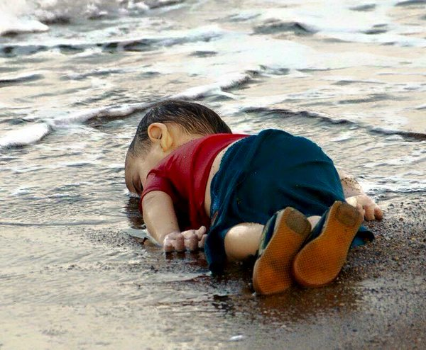

:tocdepth: 1

.. _article_16:

=============

.. container:: center

    by :ref:`brant`

        Kiyiya vuran insanlik: Humanity washed ashore

I like to pretend to be pacifistic and hate free but deep down I know somewhere
that it's a lie. Hate exists in me. Maybe it isn't always expressed—buried
deep where I can ignore it most of the time—but its there.
