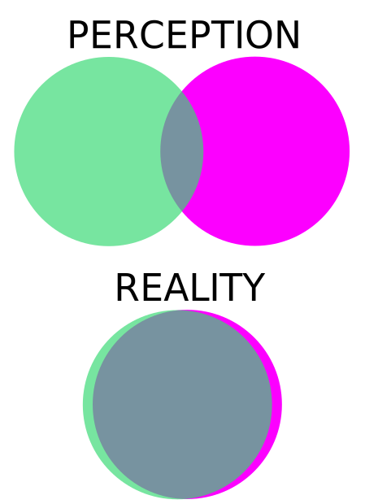

:tocdepth: 1

.. _article_18:

The Rift: Memory
================

.. container:: center

    by :ref:`brant`

Despite the awesomeness that is Asinine Media its members—including myself—have
day jobs. We use a persistent group chat to stay keep in touch, debate issues,
and ponder new ideas. It should also be mentioned that in many ways we are an
imbalanced group. There is a much greater amount of perspective alignment
between myself and :ref:`chris` than there is with :ref:`jesse`. :ref:`matt` is
of course his own unique world. At best this means that discussions often end
up with Jesse juggling rhetoric between myself and Chris and at worst it means
we gang up on him and pile on the info without giving him a chance to speak or
taking the time to listen. I wanted to make sure that this was clear because
on the topic I'm about to discuss I'm going to be making things a little bit
more personal before I get really long winded and philosophical and eventually
lose what little audience I had. In any case, this discussion got fairly heated
and in the process I believe I was responsible for upsetting Jesse, a close
friend and person in whom I place a great deal of respect and admiration.

First some background. Here is the article that sparked the initial debate:

  `Canada Apologizes and Pays Millions to Citizen Held at Guantánamo Bay <https://mobile.nytimes.com/2017/07/07/world/canada/omar-khadr-apology-guantanamo-bay.html>`__.

If you don't feel like reading that or you are somehow arriving here in the
year 2090 and that link is dead the basic bullet points are as follows:

- In 2002 at age 15 Omar Khadr was captured by American Troops in Afghanistan
- He plead guilty to using a hand grenade to kill a member of the US military
- His lawyers subsequently said he made the plea only to avoid indefinite
  detention
- The Canadian government made little or no effort to secure his return to
  Canada
- The Federal Court of Canada found that the government of Canada's failure to
  seek his return violated his rights.
- A settlement eventually awarded him ~ $8,100,000 US Dollars

.. warning:: Quotes I post from either myself, Jesse, or Chris may be
   slightly edited for brevity, formatting, spelling, or clarity. If I
   have mis-characterized a comment then I apologize in advance.

The initial disagreement basically boiled down to the following arguments:

.. admonition:: Jesse's Perspective
   :class: admonition tip

   A payout like this should never happen under any circumstances.

.. admonition:: Brant's Perspective
   :class: admonition tip

   A payout like this should have happened IF that is what the law of Canada
   says and/or requires.

I found myself taking what I had actually expected Jesse's view to be and
defending *that*. To my recollection I had always assumed Jesse was very much
strictly in favor of enforcing the rules that exist. Probably I assumed this
because in general Jesse is far more conservative than I am and part of my
perception of conservative ideology is that it is very change resistant and
prefers solid well established institutions that don't change much over time.
Here though I was puzzled. Why wasn't Jesse on **MY** side this time? And why
did things eventually become so testy? We were having a very reasonable
discussion at first right? Why did it take a negative turn? And of course when
it did who started it? Clearly not me. I have no recollection of starting
hostilities...

.. admonition:: Jesse
   :class: admonition tip

   I think Trudeau called it a win for human rights I believe.

.. admonition:: Brant
   :class: admonition tip

   I don't have a problem with that necessarily; that is if they are
   essentially saying that some rights were indeed violated. Under their law.
   I think you HAVE to stick to your own rules no matter the circumstances.
   Or you all you are doing as a country is forfeiting your own sovereignty.

.. admonition:: Jesse
   :class: admonition tip

   Then I would have simply made a new law... retroactively.

.. admonition:: Brant
   :class: admonition tip

   That's illegal in the US to do. I don't know about in Canada but I know it
   is in a lot of places for obvious reasons. That's an absolutely mental idea.

Oh! Would you look at that? Shots fired and it was *me* saying his idea was
**mental**. I would have sworn that *he* was the one who fired the first shots
but in this case chat history doesn't lie...

.. admonition:: Jesse
   :class: admonition tip

   No way a terrorist would get money. It Just wouldn't happen. Why the fuck
   would this guy ever see the light of day again anyway?

.. admonition:: Brant
   :class: admonition tip

   Doesn't matter. I'd give it. IF our laws said we should. That's the big IF.

Things are suddenly more acrimonious. Isn't it weird how you can call an idea a
name rather than attack it on substance and then be surprised that the tone of
the discussion changed? I sure was surprised. At this point as my way-to-long
sentences were being hammered out rapidly I was sure of my own objectivity and
moral high ground.

.. admonition:: Jesse
   :class: admonition tip

   Fuck.. I might as well become a terrorist. It pays

.. admonition:: Brant
   :class: admonition tip

   It might pay if your rights are somehow violated.

.. admonition:: Jesse
   :class: admonition tip

   Then thank God your not in the government

.. admonition:: Brant
   :class: admonition tip

   No. Thank god you're not!

.. admonition:: Jesse
   :class: admonition tip

   Go fuck yourself.

.. admonition:: Brant
   :class: admonition tip

   You want to give up our power as people and put it in the hands of of the
   government and let them retroactively apply laws to people they decided
   they hate.

.. admonition:: Jesse
   :class: admonition tip

   Why man... pay everyone who kills people. That's a great idea. Really smart.

.. admonition:: Brant
   :class: admonition tip

   I didn't say pay everyone who kills people that's insane.

.. admonition:: Jesse
   :class: admonition tip

   Might as well take the side of a terrorist

.. admonition:: Brant
   :class: admonition tip

   I said we have to stick to our OWN rules or we're fucktards. If we don't
   stick to our own rules in how we treat our citizens.

I'm not going to keep this going. You get the point. The substance has died.
We've resorted to name calling. There is no longer a discussion of ideas and
their merits. There is no longer meaningful debate. We've become no different
from the media we often mutually are disturbed by. And even as I construct this
article I **feel** the tug. I want to scream to the high heavens something
meaningful about my point. I want the people who read this to take *my* side in
the debate. "Oh Brant you're side is correct. You're so smart and right. Thank
goodness your level head is here to save us from our own dumb ideas"... blah
blah blah... I mean seriously why do I want that? What kind of horrific ego is
in here screaming about the pristine nature of it's **privileged** vantage
point?

The reality is that Jesse and I have two different perspectives and sets of
values on issues like this. And while I don't probably perfectly understand his
perspective I think it is something like this: *There should be no reward for
unspeakably horrifying acts. To do anything different would be a compromise of
our integrity and an affront to decency. It's inhuman and there is zero room
for tolerance. Simply put, you don't reward bad behavior and you definitely
don't reward inhuman behavior.* I'm not going to try to paraphrase my own as in
this case it isn't important. I write this because I want to express to Jesse
that I make a good faith attempt to see things from other angles including his.
Maybe even in retrospect I got it all wrong. I know I will not always succeed
but I try. I do not want dissenting opinion to be perceived as disrespectful. I
know that there is a way of looking at things from which one can arrive at the
conclusions that Jesse arrived at and have it be logical and consistent. That
it has it's own quality and that's a good thing. If we all thought the same
things then there would be no diversity and no diversity would mean the end of
humanity. We'd lose that which makes us human.

And thus here we arrive.

-------------------------------------------------------------------------------

**THE RIFT**

-------------------------------------------------------------------------------

The diversity of thought is both a tool through which humanity as a whole can
explore ideas. It also gives rise to each of our own unique identities. We move
through life putting things into categories and then we argue about the
categories and their validity. A great deal of focus is placed on the areas
where perspectives identify things in different ways. This is it's own form of
myopia. We often perceive each other as very different and consider those
differences to be ways to categorize enemies.

I get why the rift exists. We wouldn't exist without it. It's necessary for
diversity. It's necessary for individuality. It's required for the persistence
of any group.

*but...*

It doesn't have to color everything. There is no requirement that it need to be
ignored whilst dividing us. A progression towards polarization is *not*
necessary. Closeness to one another, cooperation, collaboration... these are
actions that require effort. I want to stand for something in all of this and
it has nothing to do with political persuasion. There is something bigger.
There is a way to think about things that doesn't require you to change your
political views or morals or anything else and yet I still believe it is useful
and something that I want to share with those around me. I know it is going to
sound silly and possibly boring but bear with me for a little bit. Here goes...

.. warning:: Entropy is the enemy.

It's easier to move progressively from order to disorder. It takes work—aka
energy—to produce order. This (roughly) is known as entropy. For example:

- It's easy to break a glass but difficult to reconstruct it perfectly.
- A bit of sand might blow around randomly into the perfect spot for the
  building of a sandcastle but it's very unlikely that a sandcastle will
  randomly appear. It's also the case that left alone a sandcastle will return
  to a state of disorder over time as this is more *likely* than the opposite
  result.

This works even with emotional states:

- It is easier to ruin trust than build it. Much like the broken glass it takes
  more work to rebuild than it did to destroy.

Anything left unmaintained is doomed to crumble more rapidly. If you build a
nice house you have to repair damage from storms, trim plants, etc... parts
wear out. Roofs age and sag. Materials deteriorate.

Nations, governments, towns, and even friendships are subject to the whims of
entropy. Unmaintained relationships mean people drift away. Commonality is lost
and all that remains is a memory of closeness because people change over time
and if you don't constantly work on the elements of the friendship and maintain
them then those changes will slowly separate you.

We all know that we're doomed. We're all clinging to the surface of a small
world huddled by our sun—a tiny flame in the vast empty cold expanse of space.
All the while we hurl toward inevitable death. Whatever we build is dust. The
great pyramids will crumble. Everything has it's end. There is no stopping the
slow steady march of entropy. We know this on some level. Each of us with the
capacity to think has considered this. This realization causes some to despair
or give up but most people soldier on. Why? Our greatest trait: **Defiance**.

In my eyes a great person is one who builds in the face of certain oblivion.
They construct despite the difficulty and despite the effort involved and they
do so knowing that nothing they do with last forever. The golden record on the
Voyager spacecraft may last a million years or more but even if it lasted a
billion years it is nothing more than a blink along the cosmic time-line. It's
an act of true defiance to produce order in a universe where an increase in
overall disorder is an immutable law of nature. It's the truest definition of
life in some ways. Life is a special fleeting kind of order than carries with
it something intangibly beautiful. It could be argued that life is a way to
harnesses entropy itself to impose a special temporary order on the world. It
changes with each generation, always one step ahead of the disorder that chases
would destroy it were it ever to catch up. The extinct lineages of animals and
plants all gave up their existence in a diverse quest for their projection of
order into the future. It is because of this that I say to anyone who read this
far: build. Imagine. Do. Act. The thing that we share with all life is the
ability to project something beyond our own self. Our pattern may go but we can
create the frameworks for the next round of order to emerge. Do not cling to a
past which is inevitably going to be worn away by time. Embrace constructive
change because change takes WORK and that means building and that means
standing starkly in defiance against the universe itself. Anything that refuses
to change has given up. Be a warrior—not for something static or unchanging but
rather for life itself.

It is ALWAYS easier to try to tear things down. Ideas. Buildings. People.

I don't care really who is right about some court case here or some political
idea there. I don't care about what thing Trump said today or what the media
pitched a fit over. I do care about my friends and having constructive
relationships with them. I care about the things we can build and the ideas we
can have. I care about the construction and debate of ideas. I don't care about
tearing them down. That's the problem with many things right now. Destruction
sells and it's just way easier to do. It's fun to watch people destroy each
other on cable news. *YEA GET EM! Good point! Really told it to that stupid
snowflake liberal! He deserved it for being so dumb. YEA! OH MAN! You really
put that narrow minded conservative in his place! He deserved it for being a
racist!*  Screw that SHIT. Put it away. It's corrosive. It is destructive. What
are they building? Nothing. It's a pile of emotional narcotics being spoon fed
to us because we lap it up. And you know what? Screw me for letting that rot
reach me... for letting me fall in to that same trap of ignorance and
destruction and pointless bullshit that I KNOW is there and that I so
annoyingly like to point out.
