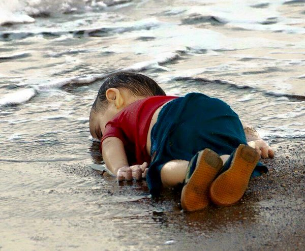

:tocdepth: 1

.. _article_17:

Dear Media: STFU
================

.. container:: center

    by :ref:`brant`

I did not support Donald Trump in the general election and I often found myself
appalled by the things he said whilst simultaneously in conflict about whether
I should be impressed by the fact that he had the gall to say those things.
Trump is a salesman and one of the things he's best at selling to people is
himself. He's willing to take on whatever mantle is beneficial to the moment
and that makes it difficult to know where he stands on most issues. To some
this is a problem but I think it's also fair to say that this is a skillset.

Trump may not be a great administrator but he is something different from the
polished fakeness of the traditional politician. He was fake too but he wasn't
fake in some elitist perfectionist way where every detail of his actions is
predicated by research and focus groups and someone deciding what brand of
watch is appropriate to wear for each campaign stop.

Of course now that he's elected the people who didn't support him are up in
arms.

i
        Kiyiya vuran insanlik: Humanity washed ashore

I like to pretend to be pacifistic and hate free but deep down I know somewhere
that it's a lie. Hate exists in me. Maybe it isn't always expressed—buried
deep where I can ignore it most of the time—but its there.
