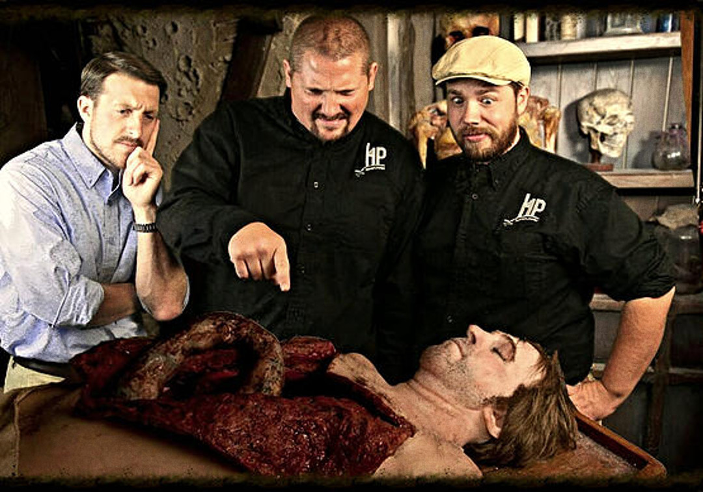
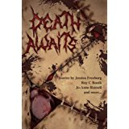

        Crush our enemies. See them driven before us. Hear the lamentations of
        our readers.

.. _harrenpres:

Harren Press
============
Harren Press is a small book publisher based out of Kansas, USA. It was founded
in 2012 by :ref:`jesse` and :ref:`chris`. With the help of Brianna Guinn,
Samantha Lafantasie, and friends Nick and Jules Bastin, we had a successful
first launch of the novella, A Song of Betrayal, by Jesse Duckworth.

In late 2013, :ref:`matt` joined Harren Press. He brought Death Awaits horror
anthology with him. He currently heads our horror division.

In March of 2014 :ref:`brant` joined the team as an investor and graphic
designer. He works on all our cover designs and helps with concept development.

A Song of Betrayal
------------------
The Adventures of Weylin Book 1

.. figure:: ../../images/song_of_betray_small.jpg
        :target: https://smile.amazon.com/Song-Betrayal-Adventures-Weylin-Book-ebook/dp/B00EYPUJB2/
        :align: left

Weylin, once a Keeper and second to the queen, is disgraced by his new
title—Outcast. One-hundred sixty-two years of lonely nights pass before he’s
found by an old acquaintance. They embark on an adventure that takes them
across the Vetr Sea, where tales of sea creatures come to life and pirates give
chase. Along this journey, Weylin must decide where his allegiances lie as the
political tides in Harren are shifting. Death follows Weylin, and unless he
fights, it will be his own.

`buy on amazon <https://smile.amazon.com/Song-Betrayal-Adventures-Weylin-Book-ebook/dp/B00EYPUJB2/>`__

The Bone Sword
--------------
Cycle of Malik Book 1

Deserter on the Run Malik emerges from the swamps of Plaiden seeking only
shelter, food, and the time necessary to take the chill from his bones. But
after a barroom brawl lands him in trouble with the local authorities, he flees
to the mountains with two orphaned children who have the power to heal.

Pursued by the vicious Father Ivory and his Nightshades, Malik and his charges
become the center of a grassroots movement that quickly blossoms into a
full-fledged revolution. Their problems are compounded when news of their
exploits draws the attention of Malik’s former Captain, a swordsman of
legendary prowess who will not stop until Malik and his followers are dead.

As the final battle approaches, Malik must face both his inner demons and his
former master in a duel that will determine the fate of the free people of
Miscony.

`buy on amazon <https://smile.amazon.com/Bone-Sword-Cycle-Malik-Book-ebook/dp/B00O6LOI8Y/>`__

Chords of Charis
----------------
A Song Matron Story Book 1

.. figure:: ../../images/chords_of_charis_small.jpg
        :target: https://smile.amazon.com/Chords-Charis-Song-Matron-Story-ebook/dp/B00PBIG5LY/
        :align: left

In the lands of the Vetr, Charis—a young orphan girl—is hidden away from an
enemy who will stop at nothing to see her blood decorate their knives. Little
do they know, if she finds out her true identity, her wrath will echo for
generations to come.

With her companions she fights to stay alive and discover her destiny. Join
them as they seek truth, love, and eventually, revenge.

`buy on amazon <https://smile.amazon.com/Chords-Charis-Song-Matron-Story-ebook/dp/B00PBIG5LY/>`__

Gears, Gadgets & Steam
----------------------
Tinkered Tales Book 1

| Gears turn.
| Gadgets whir.
| Steam rises.
|

When the smoke clears, a story was left behind. One full of adventure and
intrigue. In all, it takes the ingenuity of sixteen tinkerers to engineer this
tale where airships fight dragons for control of the skies, robots discover the
fountain of youth, and outlaws search for a source of power.

Be as brave as a girl named Hawk and delve into this book. It’s no time for
caution.

`buy on amazon <https://smile.amazon.com/Gears-Gadgets-Steam-Tinkered-Tales-ebook/dp/B00WYOSXEA/>`__

Sherlock Holmes And The Case Of The Man-Made Vacuum
---------------------------------------------------

.. figure:: ../../images/holmes_vacuum_small.jpg
        :target: https://smile.amazon.com/Sherlock-Holmes-Case-Man-Made-Vacuum-ebook/dp/B00IU0T1Q6/
        :align: left

Steampunk Victorian England is brought to life in this rousing tale of murder
and intrigue featuring literature’s greatest detective: Sherlock Holmes. In an
era of boilers and coal, inventor Samuel Brown finds himself persecuted for
daring to apply his genius to the development of a kerosene powered internal
combustion engine. Sherlock Holmes and Dr. Watson are tasked with uncovering
the source of the conspiracy, and quickly find themselves in the web of a
mysterious network capable of applying pressure at every turn. Among the
henchmen in their opposition are several characters from England’s history with
infamy to match the great sleuth’s acclaim. Not all is as it seems, but this
Sherlock is equipped with brass enhancements, and has no qualms against
fighting fire with scalding vapor and a rapier-quick mind. Excitement and
adventure abound as Sherlock Holmes enters the world of Steampunk and finds the
setting quite compatible with his unique and varied talents.

`buy on amazon <https://smile.amazon.com/Sherlock-Holmes-Case-Man-Made-Vacuum-ebook/dp/B00IU0T1Q6/>`__

Death Awaits
------------
A Scarlett Nightmare Book 1

Death Awaits. A fitting title, for that is what awaits you within its pages.
Like a blanket sewn from severed flesh, it embraces you with the comfort of
congealed blood. Exactly what you would expect from a volume bound in human
skin. I remember the symphony of screams as I flayed my victims. My blades are
still covered with their gore, but don't worry, I promise they will be clean
enough for you to see your own blood decorating them.

In the meantime, why don’t you begin reading? I promise that death will be
waiting for you when the last page is turned...

`buy on amazon <https://smile.amazon.com/Death-Awaits-Scarlett-Nightmare-Book-ebook/dp/B00KGPOC6W/>`__

In Shambles
-----------
A Scarlett Nightmare Book 2

.. figure:: ../../images/in_shambles_small.jpg
        :target: https://smile.amazon.com/Shambles-Scarlett-Nightmare-Book-ebook/dp/B00QNYL0H4/
        :align: left

In Shambles... that was my life. I sat in a cell all day wondering what could
have been. Thinking about it only made me feel worse. I was lost until someone
left me this book about people just like me. People that made mistakes...
people that tried to redeem themselves... people that failed. It helped me cope
with the things I’ve done. It helped me find peace.

To those whose lives are In Shambles, crack open this book. See what it can do
for you...

`buy on amazon <https://smile.amazon.com/Shambles-Scarlett-Nightmare-Book-ebook/dp/B00QNYL0H4/>`__
